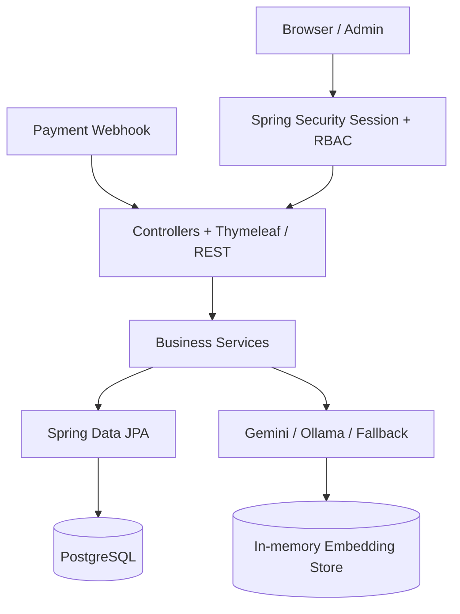

# Báo Cáo Thẩm Định Toàn Diện TechGear

**Ngày đánh giá:** 2026-09-28  
**Phạm vi:** `da/src/main`, `da/src/test`, `application.properties`, Docker, `pom.xml`, `db.sql` và các artifact test hiện có.  
**Phương pháp:** đọc source, đối chiếu luồng nghiệp vụ, quét pattern rủi ro, xem test/report hiện có và so sánh với bản đánh giá đính kèm.

## 1. Kết luận điều hành

TechGear là một monolith Spring Boot có phạm vi chức năng tốt: ecommerce, cart, order, VietQR webhook, admin, AI chatbot, RAG, WebSocket, PDF và Docker. Mã nguồn thể hiện nhiều ý thức kỹ thuật đáng ghi nhận: BCrypt, `BigDecimal`, DTO cho một số request, transaction boundary, pessimistic lock cho checkout/webhook và test concurrency.

Tuy nhiên, hệ thống **chưa nên được xem là production-ready**. Rủi ro cao nhất nằm ở secret mặc định, CSRF cấu hình quá rộng, webhook thiếu các kiểm tra tài chính quan trọng, public order-status IDOR, mutation bằng GET, mass assignment qua Entity, thiếu rate limit AI và schema/migration chưa nhất quán.

**Đánh giá thực tế: 5.5/10 ở trạng thái hiện tại.** Đây là mức phù hợp cho prototype/đồ án nâng cao hoặc pre-production, chưa phải hệ thống cấp enterprise.

## 2. Bản đồ hệ thống



Hiện tồn tại một monolith hợp lý cho giai đoạn đầu, nhưng presentation layer và data layer chưa tách rạch ròi. Một số controller gọi Repository trực tiếp và truyền Entity vào view/session.

## 3. Findings theo mức độ

### P0 - Phải xử lý trước production

#### P0.1. Webhook có secret mặc định đã biết

[PaymentWebhookController.java](da/src/main/java/com/da/da/controller/PaymentWebhookController.java) và [application.properties](da/src/main/resources/application.properties) dùng fallback `dev_webhook_secret_key_change_in_prod`.

Nếu triển khai mà quên `WEBHOOK_SECRET`, người ngoài có thể dùng secret công khai này để gọi webhook. Constant-time comparison không còn ý nghĩa nếu secret đã biết.

**Khắc phục:** bỏ fallback, fail-fast khi secret rỗng, inject secret qua environment/secret manager và thêm integration test xác nhận app không khởi động với production secret thiếu.

#### P0.2. Webhook không kiểm tra payment mode

Webhook lấy order theo ID, đối chiếu amount và chuyển order thành `PAID`, nhưng chưa kiểm tra order có phải `VIETQR` hay không. Callback VietQR có thể tác động lên order COD nếu biết ID và amount.

**Khắc phục:** chỉ xử lý order có payment mode đúng provider; reject các order COD/MOMO/VNPAY.

#### P0.3. Idempotency chưa có phạm vi toàn hệ thống

[PaymentWebhookService.java](da/src/main/java/com/da/da/service/PaymentWebhookService.java) chỉ so sánh transaction với transaction đang lưu trên order hiện tại. Một `transactionId` có thể bị gửi lại cho order khác.

**Khắc phục:** unique index cho `transaction_id`, query global theo transaction, reject khi transaction đã thuộc order khác, bắt buộc transaction ID cho callback thành công.

#### P0.4. CSRF bị tắt quá rộng

[SecurityConfig.java](da/src/main/java/com/da/da/config/SecurityConfig.java) dùng:

```java
.ignoringRequestMatchers("/api/**", "/admin/api/**")
```

Điều này loại bỏ CSRF cho cả API admin và các endpoint dùng session cookie, không chỉ webhook. Với mô hình SSR/session, đây không phải cấu hình an toàn mặc định.

**Khắc phục:** chỉ ignore `/api/webhook/**`, còn admin API phải yêu cầu CSRF hoặc dùng token-based stateless authentication riêng.

#### P0.5. Public order-status là IDOR/information disclosure

`/api/order/status/{id}` được public và trả payment status của order bất kỳ khi đoán được ID.

**Khắc phục:** yêu cầu authentication và kiểm tra ownership, hoặc dùng polling token ký riêng cho order.

#### P0.6. Tài khoản mặc định trong production

[DataInitializer.java](da/src/main/java/com/da/da/config/DataInitializer.java) tự tạo `admin@gmail.com / admin123` và `user@gmail.com / user123`, đồng thời ghi credential vào log.

**Khắc phục:** chỉ seed profile `dev`, không log password, tạo admin qua migration/secret provisioning và bắt buộc đổi mật khẩu lần đầu.

### P1 - Rủi ro cao/nghiệp vụ

#### P1.1. Mutation bằng GET

Các mutation hiện dùng GET gồm logout, delete product, delete customer, remove cart và update cart. Điều này cho phép CSRF, prefetch hoặc crawler kích hoạt thay đổi dữ liệu.

**Khắc phục:** chuyển sang POST/DELETE, có CSRF token và confirm ở UI.

#### P1.2. Race condition khi cancel/hoàn kho

Checkout và webhook có pessimistic lock, nhưng `updateOrderStatus()` dùng `findById()` thường. Hai request cancel đồng thời có thể cùng hoàn kho.

**Khắc phục:** lock order ngay đầu transaction và enforce state transition tại database/service.

#### P1.3. VNPAY âm thầm biến thành COD

[PlaceOrderRequest.java](da/src/main/java/com/da/da/dto/PlaceOrderRequest.java) cho phép `VNPAY`, nhưng [PaymentMode.java](da/src/main/java/com/da/da/entity/enums/PaymentMode.java) không có enum này. `fromString()` bắt lỗi và trả về COD.

Input sai không được fallback sang một payment mode khác. Phải reject bằng validation/business exception.

#### P1.4. Webhook order ID parser quá lỏng

Nếu không thấy prefix `DH`, service lấy số đầu tiên bất kỳ trong description. Payload không đúng format có thể được gán nhầm order.

**Khắc phục:** bắt buộc format chính xác như `THANHTOAN DH123`, reject format khác.

#### P1.5. Mass assignment qua Product Entity

[AdminController.java](da/src/main/java/com/da/da/controller/AdminController.java) bind trực tiếp `Product`. Request có thể điều khiển stock, discountSold, active, createDate, image và metadata nếu service không whitelist.

**Khắc phục:** dùng `ProductCreateRequest`/`ProductUpdateRequest`, load entity hiện tại rồi copy từng field cho phép.

#### P1.6. Validation webhook chưa được kích hoạt

[PaymentWebhookRequest.java](da/src/main/java/com/da/da/dto/PaymentWebhookRequest.java) có `@NotNull` và `@Positive`, nhưng controller không dùng `@Valid @RequestBody`.

Amount null/âm có thể đi qua controller vào service.

#### P1.7. Default enum không fail-closed

`PaymentMode.fromString()` và `OrderStatus.fromString()` trả về giá trị mặc định khi input sai. Cách này che giấu lỗi client và có thể biến request sai thành nghiệp vụ hợp lệ.

### P2 - Kiến trúc, hiệu năng và vận hành

#### P2.1. Controller gọi Repository trực tiếp

Các điểm tiêu biểu:

- [OrderController.java](da/src/main/java/com/da/da/controller/OrderController.java)
- [AdminController.java](da/src/main/java/com/da/da/controller/AdminController.java)
- [HomeController.java](da/src/main/java/com/da/da/controller/HomeController.java)

Điều này làm ownership, transaction và query policy phân tán. Nên giữ luồng `Controller -> Service -> Repository`.

#### P2.2. Entity được truyền vào session/view

`Customer`, `Order`, `Product` chứa field nội bộ và được dùng trực tiếp trong presentation. `Customer` còn có password. Nên dùng DTO/VM để tránh lộ cấu trúc persistence và giảm lazy-loading ngoài ý muốn.

#### P2.3. `findAll()` chưa được kiểm soát

Các đường dẫn đáng chú ý:

- Home product listing.
- Admin products/customers.
- `AdminAiService` reports.
- Chatbot fallback.
- Ingestion.
- Dynamic recommendations.

Nên dùng projection, query filter và pagination/limit tại database.

#### P2.4. Upload chưa kiểm tra content thật

[FileStorageService.java](da/src/main/java/com/da/da/service/FileStorageService.java) đã dùng UUID và whitelist extension/MIME, nhưng MIME là dữ liệu client cung cấp. Chưa thấy giới hạn multipart, kiểm tra magic bytes, giới hạn dimensions hoặc cleanup file cũ.

#### P2.5. Exception handler trả message nội bộ

[GlobalExceptionHandler.java](da/src/main/java/com/da/da/config/GlobalExceptionHandler.java) đưa `ex.getMessage()` vào flash message. Có thể lộ SQL, filesystem path hoặc chi tiết infrastructure. REST API cũng có nguy cơ nhận redirect HTML thay vì JSON lỗi chuẩn.

Nên tách `@ControllerAdvice` cho MVC và `@RestControllerAdvice` cho API, đồng thời dùng error code/message an toàn.

#### P2.6. AI public không có rate limit/body limit

`/api/ai/chat` public, nhận raw string không giới hạn và có thể gọi Gemini. `ChatbotManager` fallback còn `findAll()` product. Rủi ro gồm abuse API key, chi phí, memory/resource exhaustion và prompt injection.

`/api/ai/ingest` cũng cần admin-only POST; hiện việc ingest không nên public.

#### P2.7. RAG chưa dùng persistent pgvector

[LangChainConfig.java](da/src/main/java/com/da/da/config/LangChainConfig.java) dùng `InMemoryEmbeddingStore`, trong khi Docker có container pgvector. Restart app sẽ mất embedding và nhiều instance không chia sẻ dữ liệu.

#### P2.8. Schema/migration chưa nhất quán

[db.sql](db.sql) dùng bảng `admins`, `customers`, `products`, `orders`, trong khi entity dùng `tbladmin`, `tblcustomer`, `tblproduct`, `tblorders`. `ddl-auto=update` không thay thế migration chính thức.

Nên dùng Flyway/Liquibase và chọn một schema duy nhất.

#### P2.9. Docker chưa reproducible đầy đủ

[Dockerfile](da/Dockerfile) chỉ copy `target/*.jar`, nên cần build Maven bên ngoài trước. Compose còn chứa password plaintext, thiếu healthcheck/DB readiness, resource limit và secret management.

## 4. Điểm mạnh đã kiểm chứng

- BCrypt qua `DaoAuthenticationProvider`.
- `BigDecimal` cho monetary values.
- DTO cho register/place order/webhook ở một số luồng.
- Transaction boundary rõ ở order/cart/payment.
- Pessimistic lock cho product checkout.
- Refresh entity sau khi acquire lock trong checkout.
- Constant-time comparison cho webhook secret.
- Amount verification cho webhook.
- Cart ownership check.
- Session invalidation khi admin xóa customer.
- UUID filename cho upload.
- Có test concurrency, webhook và cart IDOR.
- Admin AI có `@PreAuthorize`.
- Một số order listing đã có pagination.

## 5. Test và mức độ xác minh

Các report có sẵn trong `target/surefire-reports` cho thấy các suite trước đó từng pass:

- `PaymentWebhookControllerTest`: 5 test.
- `ConcurrencyIntegrationTest`: 2 test.
- `SecurityAndIdorIntegrationTest`: 6 test.
- `SecurityAccessTest`: 5 test.

Tổng report đính kèm tuyên bố 25 test pass, phù hợp với tổng các suite và `DaApplicationTests`/`OrderServiceTest`.

Tuy nhiên, trong phiên đánh giá hiện tại, Maven **không chạy lại được** vì môi trường không có `JAVA_HOME`/Java executable hợp lệ. Vì vậy không nên gọi kết quả 25/25 là xác minh mới nhất.

Các test còn thiếu:

- Secret production bị thiếu/fallback.
- Một transaction ID cho nhiều order.
- Webhook callback vào COD.
- Webhook thiếu transaction ID hoặc description sai format.
- Public order-status IDOR.
- CSRF trên admin API và mutation GET.
- Mass assignment Product.
- Profile/webhook/upload validation.
- Cancel order đồng thời.
- Rate limit AI và public ingest.
- PostgreSQL migration/schema compatibility.

## 6. So sánh với bản đánh giá đính kèm

| Chủ đề | Bản đánh giá đính kèm | Kết luận đối chiếu |
|---|---|---|
| Kiến trúc | Chấm 9.0, gần Clean Architecture | Đánh giá này quá cao. Có nhiều controller gọi Repository trực tiếp và bind Entity. Nên khoảng 6/10. |
| CSRF | Cho rằng ignore `/api/**` là đúng | Không chính xác. SSR dùng session cookie nên admin/user API vẫn cần bảo vệ; chỉ webhook nên được ignore. |
| IDOR | Chấm 9.5 và cho rằng gần như tuyệt đối | Bỏ sót public `/api/order/status/{id}`. Cart/order detail/invoice có kiểm tra ownership, nhưng toàn hệ thống chưa đạt tuyệt đối. |
| Webhook | Chấm 10/10 | Quá cao. Có constant-time, lock và amount check, nhưng thiếu fail-closed secret, payment-mode check, global transaction uniqueness và strict reference parsing. |
| Concurrency | Chấm 9.5 | Checkout/webhook tốt; cancel/restore stock chưa lock nên nên khoảng 7/10. |
| AI/RAG | Chấm 9.5, nói fallback đảm bảo HA 99.99% | Không đủ căn cứ. In-memory vector store, public chat không rate limit, ingest public và fallback không phải SLA. |
| File upload | Chấm 9.0 | UUID/whitelist là tốt, nhưng MIME client-controlled và thiếu size/magic-byte check. Nên khoảng 6.5/10. |
| Validation | Nói DTO đầy đủ | Chưa đúng: webhook thiếu `@Valid`, profile bind Entity không validate, admin Product thiếu DTO validation. |
| Database | Chấm 8.5 | Có OrderDetail snapshot và query aggregate tốt, nhưng `db.sql` lệch entity, `ddl-auto=update`, thiếu constraints/index. Khoảng 6.5/10. |
| Testing | Chấm 9.5 và 25/25 pass | Các artifact cũ có kết quả pass, nhưng chưa chạy lại do thiếu Java. Coverage vẫn bỏ trống nhiều case security/payment. Khoảng 7/10. |
| DevOps | Chấm 8.5, production-ready | Docker chạy được ở dev/pre-production nhưng thiếu healthcheck, readiness, secrets, migration và reproducible build. Khoảng 5.5/10. |
| Tổng thể | 9.1/10, Production-Ready/Senior Level | Không phù hợp với bằng chứng source. Đánh giá thận trọng hơn: 5.5/10, pre-production. |

### Những nhận định trong bản đính kèm vẫn đúng

- Mixed pricing được triển khai có chủ đích.
- Checkout có pessimistic locking.
- Money dùng `BigDecimal`.
- `OrderDetail` lưu snapshot tên/giá.
- Có fallback Gemini -> Ollama -> rule-based.
- Có admin session invalidation.
- Có các test concurrency/webhook/IDOR có giá trị.
- `getDynamicAccessories()` là điểm cần chuyển query xuống database.
- API exception nên có response JSON riêng.
- Vector store nên chuyển sang persistent backend.

### Những nhận định cần chỉnh lại

- Không thể gọi hệ thống production-ready khi còn secret mặc định và seed credentials mặc định.
- Constant-time comparison chỉ bảo vệ cách so sánh, không cứu được một secret public.
- Pessimistic lock chỉ xuất hiện ở một số luồng, không tự động bảo vệ cancel/status update.
- Function tool lấy user từ SecurityContext là tốt, nhưng không loại bỏ các IDOR khác ngoài tool.
- Có container pgvector không đồng nghĩa ứng dụng đang dùng PGVector.
- Test pass trong artifact không đồng nghĩa test đã pass trong môi trường hiện tại.
- Fallback AI nâng khả dụng chức năng, không chứng minh SLA 99.99%.

## 7. Scorecard hiệu chỉnh

| Hạng mục | Điểm | Nhận xét |
|---|---:|---|
| Layering/SRP | 6.0 | Service khá đầy đủ nhưng Controller/Repository còn lẫn. |
| AuthN/AuthZ | 6.5 | BCrypt/RBAC tốt, nhưng session/CSRF/public endpoint còn rủi ro. |
| IDOR | 6.5 | Một số luồng owner check tốt, public status vẫn là lỗ hổng. |
| Order/concurrency | 7.0 | Checkout tốt, cancel/status chưa đồng nhất. |
| Webhook/payment | 5.0 | Có nền tảng tốt nhưng rủi ro tài chính P0. |
| AI/RAG | 6.0 | Ý tưởng tốt, thiếu guardrail vận hành và persistent store. |
| Data/JPA | 6.0 | BigDecimal/OrderDetail tốt, migration/constraints/pagination thiếu. |
| Validation/upload | 5.5 | Có DTO và UUID nhưng coverage chưa đủ. |
| Exception/API contract | 5.0 | Redirect handler không phù hợp toàn bộ REST API. |
| Testing | 7.0 | Có test quan trọng nhưng còn nhiều blind spot và chưa rerun được. |
| DevOps | 5.5 | Có Docker nhưng chưa production hardening. |
| **Tổng thể** | **5.5** | **Prototype tốt, cần hardening trước production.** |

## 8. Roadmap đề xuất

### P0 - Trước khi deploy thật

1. Xóa toàn bộ default secret/password/payment credential.
2. Giới hạn CSRF ignore còn webhook.
3. Sửa webhook: payment mode, global transaction uniqueness, strict reference, amount/transaction validation.
4. Khóa order khi cancel/update status.
5. Bảo vệ order-status ownership.
6. Tắt DataInitializer ngoài profile dev.
7. Đổi mutation GET thành POST/DELETE.
8. Chạy lại test trên JDK 17 hoặc 21 LTS.

### P1 - Hardening kiến trúc

1. Tách DTO khỏi Entity ở admin/profile/order response.
2. Đưa Repository access ra khỏi Controller.
3. Dùng Flyway/Liquibase.
4. Bổ sung constraints/index/unique keys.
5. Bổ sung multipart size, magic-byte validation và file cleanup.
6. Pagination toàn bộ listing/report.
7. Rate limit AI, giới hạn body và timeout LLM.
8. Bảo vệ endpoint ingest.

### P2 - Scale và vận hành

1. Chuyển InMemoryEmbeddingStore sang persistent pgvector.
2. Multi-stage Docker build.
3. Healthcheck/readiness/metrics/log correlation.
4. Secret manager và backup database.
5. State machine cho order.
6. Integration test trên PostgreSQL thật.
7. Load test cho checkout, webhook và AI.

## 9. Kết luận cuối

Bản đánh giá đính kèm nhận diện đúng nhiều điểm sáng kỹ thuật, đặc biệt ở checkout, `BigDecimal`, OrderDetail snapshot, tool security và concurrency test. Tuy nhiên, bản đó đánh giá quá lạc quan vì xem các biện pháp cục bộ là bảo đảm toàn hệ thống và chưa tính đầy đủ các rủi ro P0.

Kết luận cân bằng là: **TechGear có nền tảng tốt và nhiều ý tưởng vượt mức CRUD cơ bản, nhưng hiện mới ở mức pre-production. Cần hoàn tất nhóm P0 về secret, CSRF, webhook, IDOR và state transition trước khi có thể xem xét triển khai thật.**
